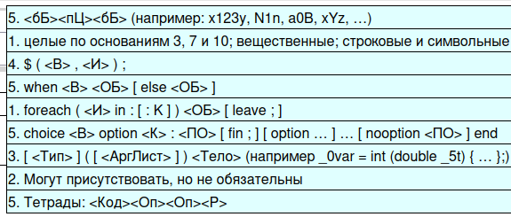

### My Rule System

program programItem*
programItem operator | function
block "{" statementList "}"
statement operator | cycleBreak
operator assignment | condition | cycle | switch | returnValue
id [a-zA-Z] [0-9] {,3} [a-zA-Z]
constDecimal [0-9] + ( [.] [0-9] * ) ?
constThree [0-2] + [x] [3]
constSeven [0-6] + [x] [7]
constChar ['] ( [] | [\\] [u] [0-9a-fA-F] [0-9a-fA-F] ) [']
constString ["] ( [] | ( [\\] ["] ) | ( [\\] [u] [0-9a-fA-F] [0-9a-fA-F] ) ) * ["]
UnaryOperator [~!]
BinaryOperator [-+*/] | ( [&] [&] ) | ( [|] [|] ) | ( [-+*/!=] [=] ) | ( [<>] [=] ? )
space [ \t\r\n] + {ignoreLastWord=true;}
comment [/] [/] ([]*) [\r\n] {ignoreLastWord=true;}
const constDecimal | constThree | constSeven | constChar | constString   
operation UnaryOperator | BinaryOperator
expr exprHead exprTail
exprHead id | const
exprTail (operation expr)?
assignment "$" "(" expr "," id ")" ";"
condition "when" expr block condTail
condTail ("else" block)?
cycle "foreach" "(" id "in" const ":" const ( ":" const)? ")" cycleBody 
cycleBody block
switch "choice" expr ( "option" const ":" switchBody)+ switchTail "end"    
switchBody ( block+ "fin;"? )?
switchTail ( "nooption" switchBody )?
type "int" | "char" | "string"
function type? "(" argList ")" block
argList (type? id ("," type? id)*)?
returnValue "return" type? expr ";"
cycleBreak "leave;"

### TODO: Add Type

### Finish rule system

